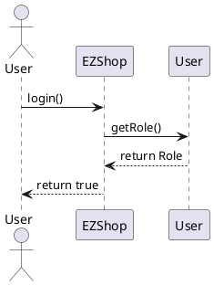
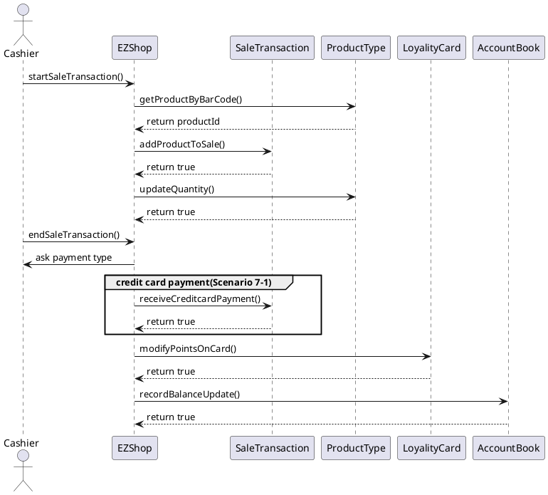
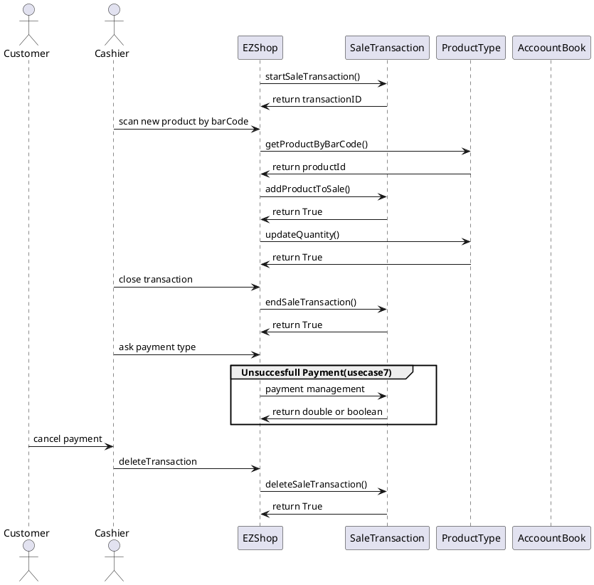

# Design Document 


Authors: 

Date:

Version:


# Contents

- [High level design](#package-diagram)
- [Low level design](#class-diagram)
- [Verification traceability matrix](#verification-traceability-matrix)
- [Verification sequence diagrams](#verification-sequence-diagrams)

# Instructions

The design must satisfy the Official Requirements document, notably functional and non functional requirements

# High level design 

<discuss architectural styles used, if any>
<report package diagram>

pattern used:
- MVC
- Layered- 3 tiered

```plantuml
@startuml
 package GUI{}
' Do we consider exceptions?

' package EXCEPTIONS{}
' EXCEPTIONS -- EZShop
note left of EZShop: Contains application logic and model
package EZShop{}
package Exceptions{}
GUI -- Exceptions
EZShop -- Exceptions
GUI -- EZShop
@enduml
```
# Low level design

<for each package, report class diagram>
<!--
## Package GUI
-->

## Package EZShop

### All classes are persistent


# Verification traceability matrix

\<for each functional requirement from the requirement document, list which classes concur to implement it>


| Class| FR1 |FR3 |FR4 |FR5 |FR6 |FR7 |FR8 |
|--|--|--|--|--|--|--|--|
|EZShop                   |X|X|X|X|X|X|X|
|User                   |X| | | | | | | 
|AccountBook            | | |X| | |X|X|
|BalanceOperation       | | |X| |X|X|X|
|Order                  | | |X| | | | |
|SaleTransaction        | | | | |X|X| |
|ProductType            | |X|X| |X| | |
|ReturnTransaction      | | | | |X| | |
|Customer               | | | |X| | | |
|LoyaltyCard            | | | |X| | | |
|Position               | | |X| | | | |
<!-- How do we menage FR7(Payment) ? --> 
<!-- Should we enter paymentState in SaleTransaction ? --> 


# Verification sequence diagrams 
\<select key scenarios from the requirement document. For each of them define a sequence diagram showing that the scenario can be implemented by the classes and methods in the design>
### Sequence diagram related to scenario 5.1


### Sequence diagram related to scenario 7.2


### Sequence diagram related to scenario 3.1


### Sequence diagram related to scenario 6.2

```plantuml
@startuml
'l'actor non può usare i metodi di EZShop ma solo eseguire azioni che gli competono, ad esempio cliccare su un pulsante e cosi via, dopo di che questa si trasforma in una chiamata ad un metodo in ezshop
'Inoltre tutte quelle che rappresentano precondition e post condition non devono essere visualizzate(login..)
actor "Cashier" as c
participant EZShop as ezs
participant SaleTransaction as st
participant ProductType as pt
participant AccoountBook as ab
' start new sale transaction
ezs -> st: startSaleTransaction()
st -> ezs:return transactionID
' get product by barCode
c -> ezs:scan new product by barCode
ezs -> pt:getProductByBarCode()
pt -> ezs:return productId
' add new product to saleTransaction(succesfull)
' update available quantity(succesfull)
ezs -> st:addProductToSale()
st -> ezs:return True
ezs -> pt:updateQuantity()
pt -> ezs:return True
' cashier applies a discount
c -> ezs: apply discountRate
ezs -> pt:getDiscountRate()
pt -> ezs:return discount rate
' apply discount rate to product(succesfull)
ezs -> st:applyDiscountRateToProduct()
st ->ezs:return True
' cashier closes a transaction(succesfull)
c -> ezs: close transaction
ezs -> st: endSaleTransaction()
st -> ezs: return True
'cashier asks for payment type
c -> ezs:ask payment type
group Succesfull Payment(usecase7)
    ezs -> st:payment management
    st -> ezs: return double or boolean
end
'update of balance(succesfull)
c ->ezs: print sale receipt and update balance
ezs -> ab:recordBalanceUpdate()
ab -> ezs:return True

@enduml
```

### Sequence diagram related to scenario 6.4

### Sequence diagram related to scenario 6.5


### Sequence diagram related to scenario 8.1


### Sequence diagram related to scenario 9.1


EZS -> u:login()
u --> EZS:return User
