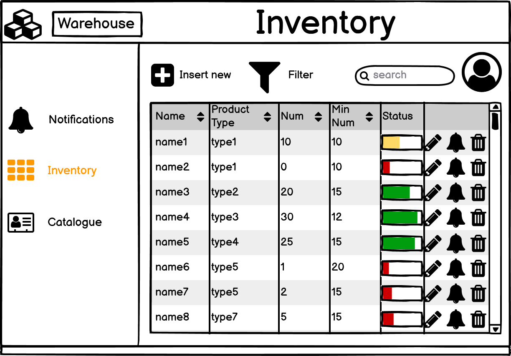
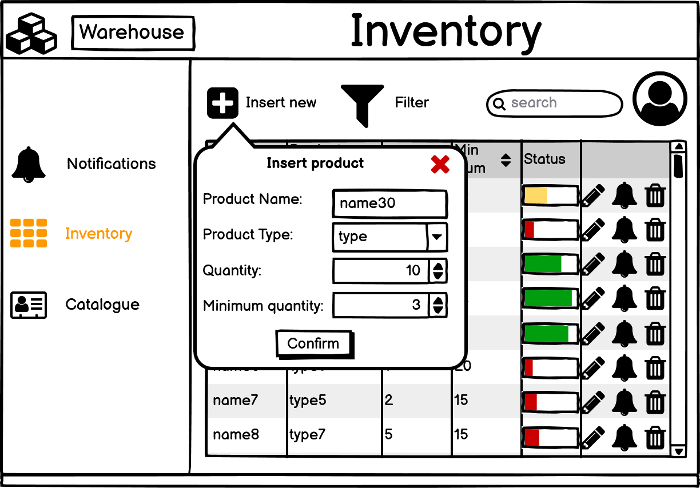
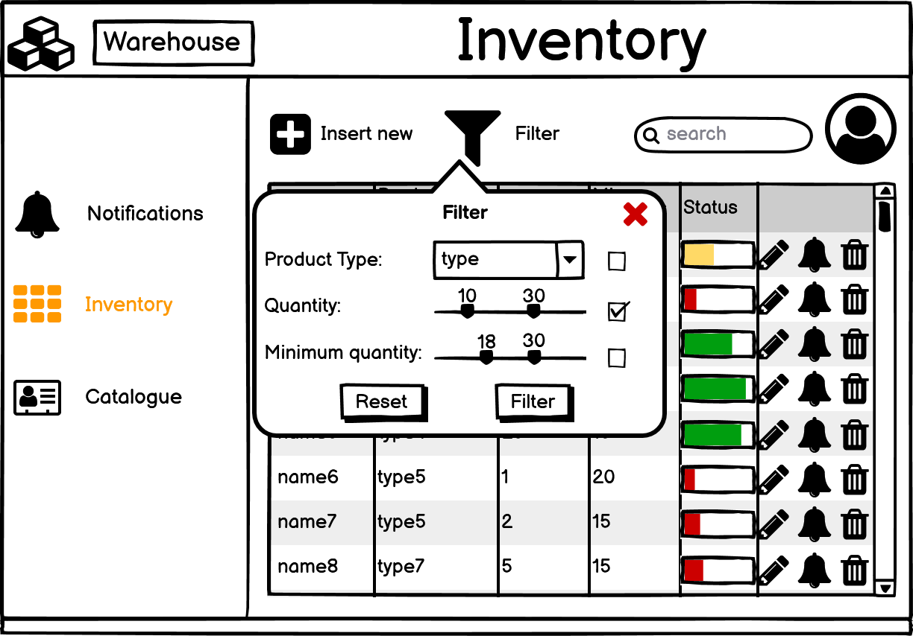
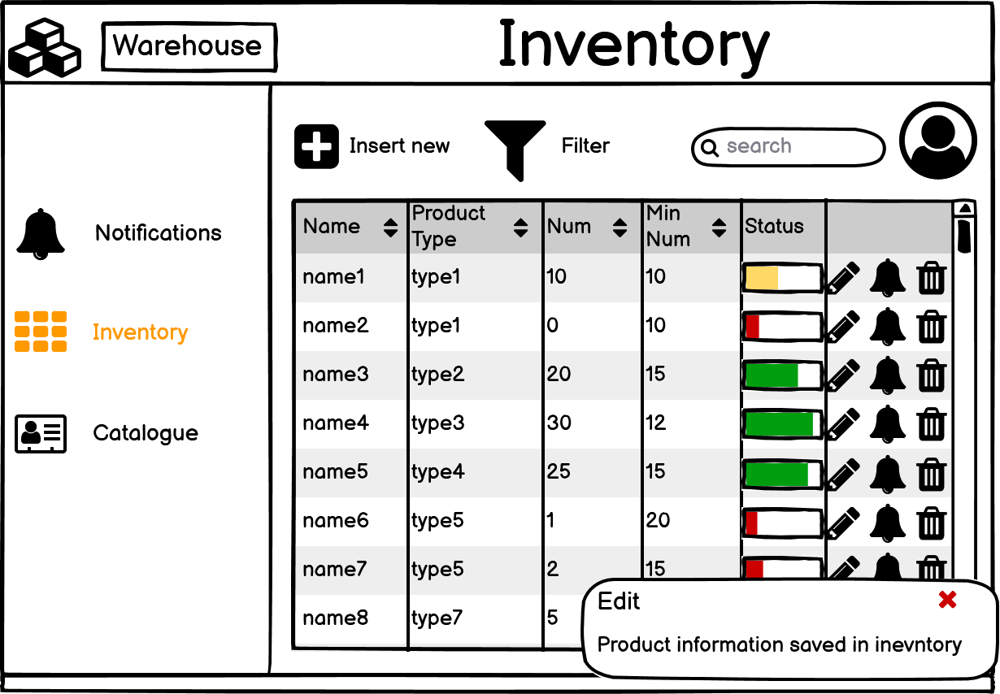
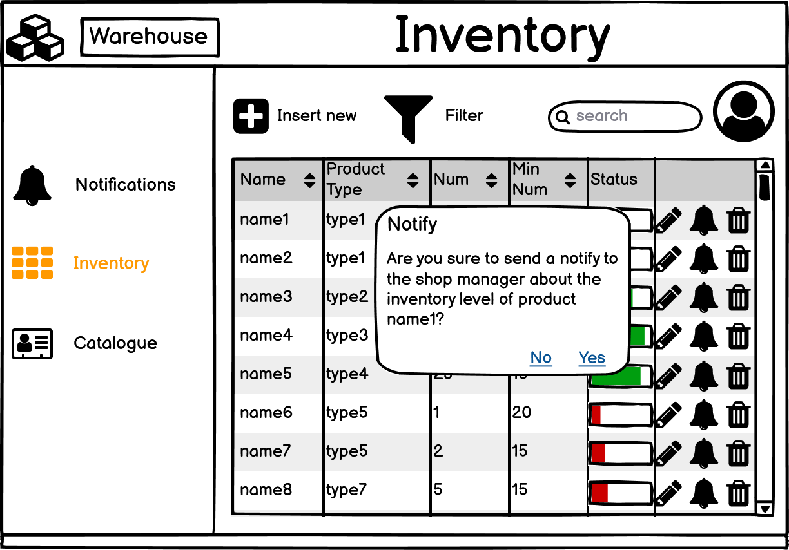
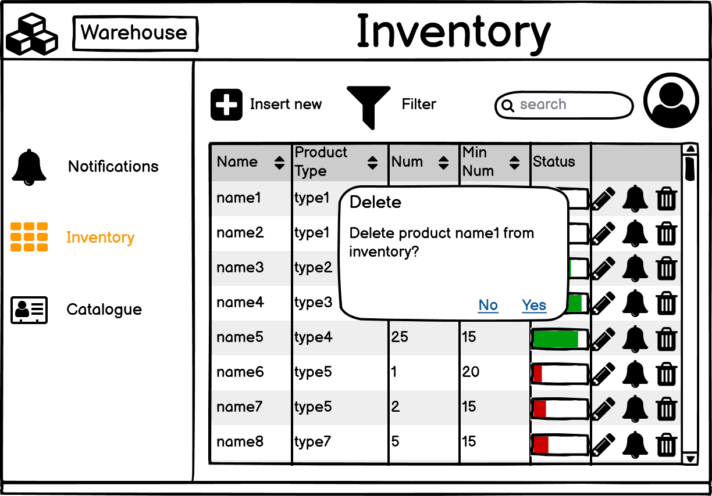

# Graphical User Interface Prototype  

Authors:

Date:

Version:

\<Report here the GUI that you propose. You are free to organize it as you prefer. A suggested presentation matches the Use cases and scenarios defined in the Requirement document. The GUI can be shown as a sequence of graphical files (jpg, png)  >
# EXShop GUI
## User login

### Login error

### Logout

### Change of user role but user not authorized

## Inventory view

### Insert a new product into inventory

### Filter products

### Edit a product

### Notify about inventory level of the product

### Delete a product from inventory

