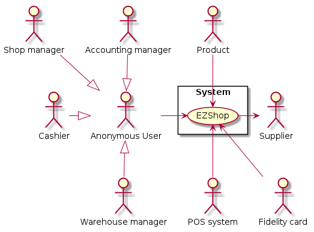

# Requirements Document 

Authors:

Date:

Version:

# Contents

- [Essential description](#essential-description)
- [Stakeholders](#stakeholders)
- [Context Diagram and interfaces](#context-diagram-and-interfaces)
	+ [Context Diagram](#context-diagram)
	+ [Interfaces](#interfaces) 
	
- [Stories and personas](#stories-and-personas)
- [Functional and non functional requirements](#functional-and-non-functional-requirements)
	+ [Functional Requirements](#functional-requirements)
	+ [Non functional requirements](#non-functional-requirements)
- [Use case diagram and use cases](#use-case-diagram-and-use-cases)
	+ [Use case diagram](#use-case-diagram)
	+ [Use cases](#use-cases)
    	+ [Relevant scenarios](#relevant-scenarios)
- [Glossary](#glossary)
- [System design](#system-design)
- [Deployment diagram](#deployment-diagram)

# Essential description

Small shops require a simple application to support the owner or manager. A small shop (ex a food shop) occupies 50-200 square meters, sells 500-2000 different item types, has one or a few cash registers 
EZShop is a software application to:
* manage sales
* manage inventory
* manage customers
* support accounting

# Stakeholders

| Stakeholder name  | Description | 
| ----------------- |:-----------:|
|   Shop manager   	| Person who manages the shop and the inventory             | 
|	Cashier			| Person who uses the cash register and register sales		|
|	Accounting manager		| Person who is responsible for accounting					|
|	Warehouse manager| Person who is responsible of managing the inventory and warehouse of the shop|
|	Customer		| Customers of the shop who do sales in the shop			|
|	Developer		| Person who develop the EZShop application					|
| 	Cash register	| Instrument that register each sale happened in the shop, contains cash received from sales and prints the sale ticket	|
|	Product			| Product that is sold in the shop and is contained in the inventory|
|	Inventory		| List of available product in the shop	that can be contained into a database|
|	Supplier		| Person who sell the products to the shop manager			|
|	POS system|	System that manages credit cards payments from customers|
 
# Context Diagram and interfaces
## Context Diagram

	@startuml context_diagram
		actor :Shop manager: as sm
		actor :Cashier: as cr
		actor :Accounting manager: as am
		' actor :Customer management system: as cms
		actor :Warehouse manager: as wm
		'	actor :Inventory and Catalogue system: as i	:
		actor :Supplier: as s
		actor :POS system: as ccs
		rectangle System{
		usecase EZShop
		}
		sm --> EZShop
		cr --> EZShop
		am --> EZShop
		wm --> EZShop
		'	i --> EZShop
		s <-- EZShop
		' EZShop <-- cms
		EZShop <-- ccs
	@enduml

 

 

## Interfaces

| Actor | Logical Interface | Physical Interface  |
| ------------- |:-------------:| -----:|
|   Shop Manager    | GUI 		| Screen, keyboard, mouse  	|
|	Cashier			| GUI 		| Screen, keyboard, mouse?	|
|	Accounting manager| GUI		| Screen, keyboard, mouse	|
|	Warehouse manager| GUI		| Screen, keyboard, mouse	|
|	Supplier		| Purchase order file	| Email on the network containing as attachment the order	|
|	POS management system| ECR interface described at <a href="https://www.ccv.eu/wp-content/uploads/2018/05/zvt_ecr_interface_specification.pdf" >ECR</a>| Wired connection|
<!--|	Customer management system	| Web service |	Internet connection|-->

<!--|	Inventory and catalogue system	| Queries		| Database connection over the network	|)-->
 

# Stories and personas

The following personas and stories represent possible actors profiles.
 
 
Matteo is 40, works, owns and manages a small food shop. He has to check the inventory every day and place orders to his suppliers for goods for his shop. He is always in hurry so he wants to spend less time as possible in doing managing stuff and concentrate more on his customers.
 
 
Laura is 60, she has always worked in the shop of her parents and now she owns it. She is not very familiar with technology stuff but she needs something to better manage the inventory of her shop. She has 2 nephews and she wants to spend as much time as possible with them so she has assumed a cashier for her shop that manages the sales and helps her.
 
 
Luca is 25, he works as a cashier in a small shop. During his work, he has to help the shop manager in updating the inventory level of the product sold in the shop. This requires him to stay in the shop after the closing hour to check the inventory. He would really like to spend this time with his friends so he wants that the inventory is as fast as possible.
 
 
Giorgia is 50, she works as a supplier for many small shops in Turin. Since she is very forgetful and, for that reason, she always looks to her email to check for the orders of the managers of the different shops. 
 
 
Giovanni is 45, he helps the manager of a small food shop in managing the accounting of the shop. He has a daughter and he would like to spend all of his time with her. The manager of the shop he works for requires daily, weekly and monthly reports about the entries and the invoices of the shop. That requires a lot of time and he would like to do that faster in order to have more free time.
 
# Functional and non functional requirements

## Functional Requirements

| ID        | Description  |
| ------------- |:-------------:| 
| FR1   | Manage Inventory|
| FR1.1	| Check inventory level for a product type|
| FR1.2	| Update inventory level for a product type (increment or decrement products quantity) |
| FR1.3	| Show inventory level for each product type|
| FR2	| Manage Catalogue|
| FR2.1	| Add a new product type|
| FR2.2	| Remove a product type|
| FR2.3	| Update product type information|
| FR2.4	| List all product types|
| FR2.5	| Search a product type|
| FR3	| Manage sales|
| FR3.1	| Register into system a sale for a product|
| FR3.2	| Remove a previous sale|
| FR3.3	| Manage payment with credit card|
| FR3.4	| Compute sale ticket|
| ??? FR3.5	|	Manage replacement (remove a previous sale and use the credit to buy a new item)	
| FR4	| Manage accounting|
| FR4.1	| See all invoices|
| FR4.2	| Get current balance|
| FR4.3	| Add a new invoice|
| FR4.4	| Set a invoice as payed|
| FR4.5	| Filter invoices using supplier, product type, total amount, ...
| FR4.6	| Generate report with balance, invoices and entries|
| FR4.7	| Add a new earning|
| FR4.8	| search an invoice|
| FR5	| Manage customers|
| FR5.1	| Add a new customer|
| FR5.2	| See all customers|
| FR5.3	| Remove a customer|
| FR5.4	| Search a customer|
| FR5.5	| Add a fidelity card for a customer|
| FR5.6	| Update fidelity card|
| FR6	| Manage users|
| FR6.1	| Add a new user|
| FR6.2	| Remove a user|
| FR6.3	| View all users|
| FR6.4	| Manage access rights for a user|
| FR6.5	| Authenticate user|
| FR7	| Manage suppliers|
| FR7.1	| Add a new supplier|
| FR7.2	| List all suppliers|
| FR7.3	| Remove a supplier|
| FR7.4	| Search a supplier|
| FR8	| Manage orders|
| FR8.1	| Place an order to supplier for a given product type|
| FR8.2	| Repeat a previous order to a supplier|
| FR8.3	| Abort a previously inserted order|
| FR8.4	| Search an order|

 

### Access rights, functional requirements and actor
The following table indicates which actor have the rights to perform functional requirements and the corresponding sub-requirements associated with them described above.
 
|Function| Manager| Cashier | Accounting Responsible| Warehouse manager|
|---|:---:|:---:|:---:|:---:|
| FR1 | yes | yes	| no | yes|
| FR2 | yes | no	| no | yes|
| FR3 | yes | yes	| no | no |
| FR4 | yes | no	| yes| no |
| FR5 | yes | yes	| no | no |
| FR6 | yes | no	| no | no |
| FR7 | yes | no	| no | no |
| FR8 | yes | no	| no | yes|
 

## Non Functional Requirements

| ID        | Type (efficiency, reliability, ..)           | Description  | Refers to |
| ------------- |:-------------:| :-----:| -----:|
|  NFR1 | efficiency  	| Time to show the whole inventory < 500ms  | FR1.4|
|  NFR2 | correctness 	| Maximum number of different product types >= 2000  | FR2|
|  NFR3 | efficiency 	| More sales can be registered at the same time by different cash registers| FR3.1|
|  NFR4	| efficiency	| Show customer list time < 500ms | FR5.2 |
|  NFR5	| efficiency	| User authentication procedure time < 500ms| FR6.5|
|  NFR6	| usability		| No specific training should be needed to use the software| All FR|
|  NFR7	| portability	| Software should be available on any OS (Windows, Unix/Linux, MacOs)| All FR|
|  NFR8	| localization	| Currency is EURO | all FR|
|  NFR9	| localization	| decimal separator is '.'| all FR|
|  NFR10| security		| all user roles should access only the functions their access rights allow to| all FR|
|  NFR11| security		| Treat user data according to GDPR| |

 

# Use case diagram and use cases

## Use case diagram

	@startuml usecase_diagram
		' actors
		actor :Shop manager: as sm
		actor :Cashier: as cr
		actor :Accounting manager: as am
		actor :Warehouse manager: as wm
		actor :Supplier: as s
		actor :POS System: as ccs
		' use cases
		usecase "FR1 Manage inventory" as mi
		usecase "FR2 Manage catalogue" as mca
		usecase "FR3 Manage sales" as ms
		usecase "FR4 Manage accounting" as ma
		usecase "FR5 Manage customers" as mc
		usecase "FR6 Manage users" as mu
		usecase "FR7 Manage suppliers" as msu
		usecase "FR8 Manage orders" as mo
		usecase "FR6.5 Authenticate user" as mua		

		' associations
		mu --> mua: <<include>>
		ms -- mi
		mo - ma
		' shop manager 
		sm --> mu
		' sm --> ma
		' sm --> mi
		' sm --> mc
		' sm --> ms
		sm --> msu
		sm --> mo
		' sm --> mca
		' accounting manager
		ma <-- am
		' cashier
		' mi <-- cr
		cr --> ms
		mc <-- cr
		' POS system
		ms --> ccs
		' warehouse manager
		mi <-- wm
		mca <-- wm
		' supplier 
		mo --> s
	@enduml

 

 

### Use case 1, UC1 - Manage inventory

| Actors Involved        | Warehouse manager |
| ------------- |:-------------:| 
|  Precondition     | User is authenticated|
|	| User has role warehouse manager | 
|  Post condition     | The inventory is modified|
|  Nominal Scenario     | The warehouse manager wants to modify the inventory|
|  Variants     | Product type does not exists  |

##### Scenario 1.1 - Inventory level of a product type retrieved

| Scenario 1.1 | Inventory level retrieved|
| ------------- |:-------------:| 
|  Precondition     | User is authenticated|
|	| User has role warehouse manager | 
|	| Product type required exists|
|  Post condition     | User has read the inventory level of the product type|
| Step#        | Description  |
|  	1   | Check for existence of the required product type|  
|  	2   | Product type exists|
|  	3   | Read into inventory the quantity of the product type |
|	4	| Show the number read to the user|

##### Scenario 1.2 - Product type does not exists

| Scenario 1.2 | Product type does not exists|
| ------------- |:-------------:| 
|  Precondition     | User is authenticated|
|	| User has role warehouse manager | 
|	| Product type required does not exists|
|  Post condition     | User receives error message|
| Step#        | Description  |
|  	1   | Check for existence of the required product type|  
|  	2   | Product type not exists|
|  	3   | RShow error message|

##### Scenario 1.3 - Increment inventory level of a product type

| Scenario 1.3 | Increment inventory level of a product type|
| ------------- |:-------------:| 
|  Precondition     | User is authenticated|
|	| User has role warehouse manager | 
|	| Product type required exists|
|  Post condition     | inventory level is incremented with the new value|
| Step#        | Description  |
|  	1   | Read inventory level of the product type required|  
|  	2   | Read the value to be added to the inventory level|
|  	3   | Sum actual inventory level with the new value|
|	4	| Store the computed value into the inventory|

##### Scenario 1.4 - Decrement inventory level of a product type

| Scenario 1.4 | Increment inventory level of a product type|
| ------------- |:-------------:| 
|  Precondition     | User is authenticated|
|	| User has role warehouse manager | 
|	| Product type required exists|
|  Post condition     | inventory level is decremented with the new value|
| Step#        | Description  |
|  	1   | Read inventory level of the product type required|  
|  	2   | Read the value to be subtracted from the actual inventory level|
|  	3   | Subtract the new value from the actual inventory level|
|	4	| Check if computed value is below 0|
|	5	| Computed values is >= 0 so  store the computed value into the inventory|

### Use case 2, UC2 - Manage catalogue

| Actors Involved        | Warehouse manager |
| ------------- |:-------------:| 
|  Precondition     | User is authenticated|
|	| User has role warehouse manager | 
|  Post condition     | The catalogue is modified|
|  Nominal Scenario     | The warehouse manager modifies the product types presents in the shop catalogue|
|  Variants     | Product type already exists |

##### Scenario 2.1 - Add a new product type and this type does not exists

| Scenario 2.1 | Add a new product type and this type does not exists|
| ------------- |:-------------:| 
|  Precondition     | User is authenticated|
|	| User has role warehouse manager | 
|	| Product type to be inserted does not exists|
|  Post condition     | A new product type is added|
| Step#        | Description  |
|	1	| Check if the product type to be inserted exists in the catalogue|
|	2	| The product type does not exists|
|	3	| Add to the catalogue the new product type|

##### Scenario 2.2 - Add a new product type and this type exists

| Scenario 2.2 | Add a new product type and this type exists|
| ------------- |:-------------:| 
|  Precondition     | User is authenticated|
|	| User has role warehouse manager | 
|	| Product type to be inserted exists|
|  Post condition     | An error message is shown|
| Step#        | Description  |
|	1	| Check if the product type to be inserted exists in the catalogue|
|	2	| The product type does exists in the catalogue|
|	3	| Show error message to the user|

##### Scenario 2.3 - Update product type information

| Scenario 2.3 | Update product type information|
| ------------- |:-------------:| 
|  Precondition     | User is authenticated|
|	| User has role warehouse manager | 
|	| Product type to be updated exists|
|  Post condition     | Information of the product type are updated|
| Step#        | Description  |
|	1	| Check if the product type to be inserted exists in the catalogue|
|	2	| The product type does exists in the catalogue|
|	3	| Read the information to be modified |
|	4	| Store the modifications into the catalogue|

### Use case 3, UC3 - Manage sales 

| Actors Involved        | Cashier, POS System |
| ------------- |:-------------:| 
|  Precondition     | User is authenticated|
|	| User has role cashier | 
|	| Customer wants to buy some products|
|  Post condition     | A new sale is performed|
|  Nominal Scenario     | The cashier manages a new sale happened in the shop|
|  Variants     |  |

##### Scenario 3.1 - Register a new sale with fidelity card, cash payment

| Scenario 3.1 | Register a new sale with fidelity card, cash payment|
| ------------- |:-------------:| 
|  Precondition     | User is authenticated|
|	| User has role cashier | 
|	| Customer wants to buy some products|
|	| Customer has a fidelity card|
|	| Customer pays with cash|
|  Post condition     | Sale is registered into the EZShop|
|	| Customer has received sale ticket|
|	| Cash received are into the cash register|
|	| Inventory level of sold product is updated|
|	| Shop entries are updated|
| Step#        | Description  |
|	1	| Scan barcode of the fidelity card
|	2	| Scan barcode of each product|
|	3	| Add the product to the sale ticket|
| 	4	| Repeat 2-3 for each product|
|	5	| Compute total|
|	6	| Apply discount given by fidelity card (if applicable)|
|	7	| Insert cash from customer into cash register|
|	8	| Update inventory level of all sold items
|	9	| Add the amount of money received to the current entries|
|	10	| Print final sale ticket|

##### Scenario 3.2 - Register a new sale without fidelity card, credit card payment

| Scenario 3.2 | Register a new sale without fidelity card, credit card payment|
| ------------- |:-------------:| 
|  Precondition     | User is authenticated|
|	| User has role cashier | 
|	| Customer wants to buy some products|
|	| Customer has not a fidelity card|
|	| Customer pays with credit card|
|  Post condition     | Sale is registered into the EZShop|
|	| Customer has received sale ticket|
|	| Inventory level of sold product is updated|
|	| Shop entries are updated|
| Step#        | Description  |
|	1	| Scan barcode of each product|
|	2	| Add the product to the sale ticket|
| 	3	| Repeat 1-2 for each product|
|	4	| Compute the total|
|	5	| Send total amount to the POS System|
|	6	| Wait for transaction completion|
|	7	| Update inventory level of all sold items|
|	8	| Add the amount of money received to the current entries|
|	9	| Print final sale ticket|

### Use case 4, UC4 - Manage accounting

| Actors Involved        | Accounting manager |
| ------------- |:-------------:| 
|  Precondition     | User is authenticated|
|	| User has role Accounting manager | 
|  Post condition     | An accounting report is ready|
|  Nominal Scenario     | The accounting manager insert invoices and computes the report|
|  Variants     |  |
##### Scenario 4.1 - Add invoice
| Scenario 3.2 | Register a new sale without fidelity card, credit card payment|
| ------------- |:-------------:| 
|  Precondition     | User is authenticated|
|	| User has role Accounting manager | 
|  Post condition     | A new invoice is registered |
|	| Current balance is updated |
| Step#        | Description  |
|	1	| Read data of the invoice (total amount, due date,...)|
|	2	| Set the invoice status to "Not payed"|
|	3	| Insert the read invoice to the list|
|	3	| update the balance adding total amount to due expense|

##### Scenario 4.2 - Set invoice as payed
| Scenario 4.2 | Set invoice as payed|
| ------------- |:-------------:| 
|  Precondition     | User is authenticated|
|	| User has role Accounting manager | 
|  Post condition     | A new invoice is registered |
|	| Current balance is updated |
| Step#        | Description  |
|	1	| List all invoices with status "Not payed"|
|	2	| Get invoice selected from the user|
|	3	| Set selected invoice status to "Payed"|
|	4	| Set selected invoice payment date to current date|
|	4	| Subtract due amount from the current balance due expense|
|	5	| Add the due amount to current balance total expense|
|	6	| Notify the user about the success of the operation|

##### Scenario 4.3 - Generate report of current balance
| Scenario 4.3 | Generate report of current balance|
| ------------- |:-------------:| 
|  Precondition     | User is authenticated|
|	| User has role Accounting manager | 
|  Post condition     | A report of the current balance is generated |
|	| Current balance is updated |
| Step#        | Description  |
|	1	| Get starting date from the user|
|	2	| Get all invoices with payment date between starting date and today|
|	3	| Add to the report all invoices grouped by date (sum all invoices on the same day)|
|	4	| Build a graph with all invoices added to report (axis date, sum of amounts)|
|	5	| Get all sales with date between starting date and today|
|	6	| Add to the report all sales grouped by date (sum all sales happened on the same day)|
|	7	| Build a graph with all sales added to report (axis date, sum of amounts)|
|	8	| Compute and add to report current profit |
|	9	| Store report|
### Use case 5, UC5 - Manage customers

| Actors Involved        | Cashier |
| ------------- |:-------------:| 
|  Precondition     | User is authenticated|
|	| User has role Cashier | 
|  Post condition     | The customer information are modified|
|  Nominal Scenario     | The cashier registers a new customer into the system and provides her a new fidelity card|
|  Variants     | customer data modification, fidelity card information update |
##### Scenario 5.1 - Add a new customer
| Scenario 5.1 | Add a new customer|
| ------------- |:-------------:| 
|  Precondition     | User is authenticated|
|	| User has role Cashier | 
|	| Customer information are not present in the system|
|  Post condition     | The customer information are stored into EZShop|
|	| The fidelity card is given to customer|
| Step#        | Description  |
|	1	| Copy information inserted from the customer into a form|
|	2	| Check for duplicate data into customer list|
|	3	| Customer is a new one (no same data found)|
|	4	| Assign next available fidelity card to the customer|
|	5	| Give card to the customer|

##### Scenario 5.2 - Update customer information
| Scenario 5.2 | Update customer information|
| ------------- |:-------------:| 
|  Precondition     | User is authenticated|
|	| User has role Cashier | 
|	| Customer information are already present in the system|
|  Post condition     | The customer information are updated on EZShop|
| Step#        | Description  |
|	1	| Copy information inserted from the customer into a form|
|	2	| Check for duplicate data into customer list|
|	3	| The customer is found into EZShop|
|	4	| Customer data are updated with the new one|

### Use case 6, UC6 - Manage users

##### Scenario 6.1 - 
### Use case 7, UC7 - Manage suppliers

##### Scenario 7.1 - 

### Use case 8, UC8 - Manage orders

##### Scenario 8.1 - 

# Glossary

\<use UML class diagram to define important terms, or concepts in the domain of the system, and their relationships> 

\<concepts are used consistently all over the document, ex in use cases, requirements etc>

	@startuml glossary
		class Shop{
			name
			address
			dimension
		}
		class ProductType{
			id
			firm
			unit price
			type
		}
		class Product{
			code
		}
		class Inventory{
		}
		class Catalogue
		note top of Catalogue: Contains all product \ntypes sold in the shop 
		note right of User: Represent all people working \nin the shop including the \nmanager
		class User{
			name
			surname
			age
		}
		class Role
		class Cashier{
		}
		class AccountingManager
		class WarehouseManager
		together {
		class Manager{
		}
		class Supplier{
			name
			surname
			address
		}
		class Order{
			date
			quantity
		}
		}
		class Sale{
			date
			time
			discount
			total amount
		}
		class Customer{
			name
			surname
			gender
			date of birth
		}
		class FidelityCard{
			id
			expiration date
		}
		class CashRegister{
			id
		}
		class Invoice{
			id
			amount
			due date
			status ("Payed", "Not payed")
		}
		class Balance{
			date
			total earnings
			total expenses
			total due expenses
			profit
		}
		' associations
		Shop -- Inventory
		Shop -- Catalogue
		Inventory -- "*"Product
		Product"*" -- ProductType
		Shop -- "*"User: works in <
		User -- "1..*" Role
		Role <|-- Cashier
		Role <|-- Manager
		Role <|-- WarehouseManager
		Role <|-- AccountingManager
		' orders
		Order -- ProductType
		Order -- Supplier
		Manager -- Order: places >
		Order -- Invoice: produces >
		' sales
		Sale -- "*"Product: contains >
		' catalogue
		Catalogue -- "*"ProductType: contains >
		' customer
		Customer -- "1..*"FidelityCard
		Shop -- "*"Customer
		Customer"0..1" -- "*"Sale
		' cashier
		Cashier -- CashRegister: manages >
		CashRegister -- Sale: registers >
		WarehouseManager -- Inventory: manages >
		' balance
		Balance -- Sale
		Balance -- Invoice
		AccountingManager -- Balance: manages >
	@enduml

 

 

# System Design

Not applicable since this is a software only product.

# Deployment Diagram 

\<describe here deployment diagram >

